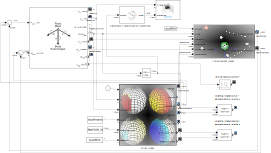

# Supplemental Code

#### Description of code
This repository contains the code required to run a simulation of a quadrotor being perturbed by a blast wave of given parameters.  Users can vary the time step, blast parameters, and vehicle parameters to tailor the model to their specific use case.

##### General matlab scripts:

* main.m: Run this script to run the simulation and plot the state/force results.
* savePlot.m: Function to save plots in a desired directory
* statesOverTimeFig.m: Script to plot states and forces over time
* pltSetup.m: Unpack output from the simulation
* generalParams.m: Calculate and pack variables for the simulation

##### Platform:
MATLAB R2025b and later

##### Environment:
Windows 10
Ubuntu 20.04

##### Run Instructions:
Lines 10-27 of main.m contain the parameters for the simulation.  Each set of parameters are explained below:
* 10-12: Simulation time parameters
    * simTime: Controls amount of time the simulation runs.
    * sampleTime: Controls the sample time for the simulation.
* 14-18: Blast parameters
    * phiB: Elevation angle of blast (deg).
    * thetaB: Azimuthal angle of blast (deg).
    * W: Explosive mass of blast (kg).
    * d0: Standoff distance of blast (m).
* 20-27: Vehicle parameters
    * rBody: Radius of body sphere (m).
    * rMotors: Radius of motor spheres (m).
    * L: Length of arms (m).
    * motorRPM: Set rpm for vehicle motors.
    * mBody: Mass of body sphere (kg).
    * mMotor: Mass of motor sphere (kg).
    * mArm: Mass of arms (kg).

main.m sets all of the required parameters, the directory information for where subroutines are located, and the other general parameters, then runs UAVSim.slx and collects pertinent data.  Plotting scripts pltSetup.m and statesOverTimeFig.m are used to process the data and generate a plot of the quadrotor's states over time for the given parameters.

If one wishes to simply run the setup for the simulink model, please adjust the parameters in simSetup.m, then run the model in Simulink.

##### Expected outputs:
Two figures containing 15 subplots each will appear after running main.m.  The first contains all of the states of the simulated quadrotor over time, and the second shows the forces acting on the quadrotor over time.  A Data.mat file and the aforementioned figures are saved in a directory named according to the parameters set by the user prior to running main.m.

Example:
* Simulation parameters
    * simTime = 0.1;
    * sampleTime = 0.0001;

* Blast parameters
    * phiB = 150;    % Elevation (deg)
    * thetaB = 90;   % Azimuth (deg)
    * W = 10;        % Explosive mass (kg)
    * d0 = 2.5;      % Standoff distance from blast (m)

* Vehicle parameters
    * rBody = 0.05;
    * rMotors = 0.05;
    * L = 0.15;
    * motorRPM = 5000;
    * mBody = 1;
    * mMotor = 0.2;
    * mArm = 0.05;

